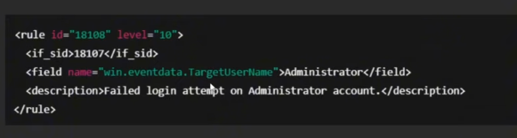

### Basic To do list
- [x] wazuh manager installation
- [x] wazuh agent installaiton (1 node)
- [ ] The HIVE installaiton - 2nd July on 
- [ ] CLAM AV installation
- [	] Manager node hardening according to CIS benchmark
- [ ] intergration of all components

Additional requirements:
- double confirm the required resources
- understand and use the wazuh manager tools to demonstrate understanding

### 18 June 2026
---
1. Installed ubuntu 22.04 (Jammy jellyfish) on 2 virtual machines
	- password : password 
2. Installed virtualbox guest additions for convenience later on 
	- install page needed to run the .iso `sudo apt install gcc make perl` , for the missing dependency

### 19 June 2026
---
1. downloading wazuh manager, following the quickstart guide to install at at once : 

	[Wazuh Quickstart guide](https://documentation.wazuh.com/current/quickstart.html)

	```bash
	curl -sO https://packages.wazuh.com/4.14/wazuh-install.sh
	
	sudo bash ./wazuh-install.sh -a
	```

- Hardware requirements :
	- Agents : 1–25
	- Cores : 4 vCPU
	-  RAM :  8 GiB 
	- Storage : 50 GB

	<details>
	<summary> Issue : installation </summary>
	Failed installation due to lack of space and memory, had to manually remove packages one by one taking up lots of time. Memory was increased to 6GB to support wazuh alone
	</details>

2. Reccommended disable the auto updates within the guide

	```bash
	sed -i "s/^deb /#deb /" /etc/apt/sources.list.d/wazuh.list

	apt update
	```

	[Wazuh single node deplayment](https://medium.com/@rupesharma203wazuh-single-node-installation-guide-for-home-lab-on-ubuntu-0eb2ca339408)

3. Testing the wazuh availability by opening the webpage on 
	- Webpage : `https://10.0.2.3:443`
	- User: `admin`
	- Password: `n*QH4zpz?nt9Te0SdV5?J5nJGEm+5zKP`

4. starting the Wazuh dashboard anytime before accessing the webpage 
	```bash
	sudo systemctl start wazuh-dashboard
	```
5. Additional :
	- to stop the services
	```bash 
	sudo systemctl stop wazuh-dashboard
	sudo systemctl stop wazuh-indexer
	sudo systemctl stop wazuh-manager
	```
	- to check what services are running :
	```bash
	systemctl list-units --type=service --state=running
	```
	- to check available system resources 
	```bash
	free -h
	```
	- check which services are using the most system resources
	```bash
	top 
	```
### 20 June 2026
---
1. installing wazuh agent on second device 
	<details>
	<summary> Issue : setting up second device </summary>
	1. Ping to check connectiviy between two devices `ip a` command to check

	- manager IP : `10.0.2.3`

	- victim IP : `10.0.2.15`

	- need to resolve the issue of having the same ip addresses
		- Create NAT network
		- assign two devices to NAT network
		- resolved

	- cmd to check connectivity : `ping -c 4 10.0.2.3`
	---
	</details>

	- Installation steps on wazuh manger agent deployment page:
		- package to install : DEB(debian) amd 64 | _extra info : RPM (red hat package manager)_
		- server address : `10.0.2.3`
		- cmd to run for installation on agent :
			```bash
			wget https://packages.wazuh.com/4.x/apt/pool/main/w/wazuh-agent/wazuh-agent_4.14.5-1_amd64.deb && sudo WAZUH_MANAGER='10.0.2.3' dpkg -i ./wazuh-agent_4.14.5-1_amd64.deb
			```
		- cmd to start agent :

			```bash
			sudo systemctl daemon-reload
			sudo systemctl enable wazuh-agent
			sudo systemctl start wazuh-agent
			```
		- cmd to check wazuh manager status :
			```bash
			sudo systemctl status wazuh-manager
			sudo systemctl status wazuh-indexer
			sudo systemctl status wazuh-dashboard	
			```
		<details>
		<summary> Issue : Succesfull setup but unable to connect on wazuh manager </summary>

		- TCP doesnt work, but DHCP(ping works)

		- troubleshooting :

			```bash
			sudo nc -l 1516
			```

			`nc` is a simple TCP server/client. If `-l` is used, it acts as a server. Otherwise it acts as a client. Used to test connectivity to a specific port.

		- solution : add `sudo` before running the manager, to ensure it has permissions to access ports

		</details>

2. Installing theHIVE on manager node

	[Detail regarding wazuh and the hive](https://wazuh.com/blog/using-wazuh-and-thehive-for-threat-protection-and-incident-response/)

	[Main : theHIVE setup guide](https://docs.strangebee.com/thehive/installation/installation-guide-linux-standalone-server/)

	[theHIVE hardware requirements for standard production](https://docs.strangebee.com/thehive/installation/system-requirements/)

	- Before installaiton, i must first be aware of theHIVE's architecture (TheHive application, database and indexing engine, and file storage), the current setup will be for a standalone server
	- Installaiton will be done using Docker for futureproof reasons
	- requirements :
		- docker engine
		- docker compose plugin
		- jq

	<details>
	<summary> Issue : NAT network setup but no internet access </summary>

	- solution (but lowkey like a duct tape fix): manually set the DNS server to 8.8.8.8 && 1.1.1.1 , the issue was DNS server was failing (as evident of ping google.com failing but ping 8.8.8.8 working)

	</details>

	Steps (Based on theHIVE setup guide): 
	1. update docker , install docker compose
	2. clone the repository
		```bash
		git clone https://github.com/StrangeBeeCorp/docker.git
		```
	3. navigate to prod1-thehive
		```bash
		cd docker/prod1-thehive
		```
	4. Before starting TheHive, initialize the environment using the provided init.sh script. within ./scripts
		```bash
		bash ./script/init.sh
		```
	5. start the docker containers containing the services theHive uses
		```bash
		sudo docker-compose up
		```
		- `-d` is to run in backgorund, omit to run in forground
		To reset when there's an error running up:
		```bash
		sudo docker-compose down
		```
		<details>
		<summary> Issue : docker compose corrupt </summary>
		
		- during  installation , several attempta of installing the hive with docker failed and the issues narrowed down to 
		</details>


### 21 June 2026
---
- installation for theHIVE failed with suspects being memory being used up
	- cassndra & elastishearch both's status is as up 
		```bash
		#error message after first failed docker compose attempt
		compose up
		Starting cassandra     ... done
		Starting elasticsearch ... done

		ERROR: for thehive  Container "d71af42b9a25" is unhealthy.
		ERROR: Encountered errors while bringing up the project.

		```
		```bash
		docker ps #to check that proceses from docker are up
		```
	- issue found from logs : 
		```
			{"@timestamp":"2026-06-21T12:44:03.511Z","log.level":"ERROR",
			"message":"fatal exception while booting Elasticsearch",
			...
			"error.message":"can not run elasticsearch as root",
			"error.stack_trace":"java.lang.RuntimeException: can not run 
			elasticsearch as root\n\tat org.elasticsearch.server@8.19.15/
			org.elasticsearch.bootstrap.Elasticsearch.initializeNatives...
		``` 
	- previous docker commands were run as root due to the issue faced in setting up wazuh, however after some digging it seems that it was not intended to run as root. Further analysis showed that there were some underlying issues, i had also not updated docker compose due to the misconception that `docker-compose` and `docker compose` are the same things. 
	- Solution : scrap the current state and restart
		- installing dependencies
		```
		# Add Docker's official GPG key
		sudo apt-get install ca-certificates curl
		sudo install -m 0755 -d /etc/apt/keyrings
		sudo curl -fsSL https://download.docker.com/linux/ubuntu/gpg -o /etc/apt/keyrings/docker.asc
		sudo chmod a+r /etc/apt/keyrings/docker.asc

		# Add Docker's repository
		echo \
		"deb [arch=$(dpkg --print-architecture) signed-by=/etc/apt/keyrings/docker.asc] https://download.docker.com/linux/ubuntu \
		$(. /etc/os-release && echo "$VERSION_CODENAME") stable" | \
		sudo tee /etc/apt/sources.list.d/docker.list > /dev/null

		# Update and install
		sudo apt-get update
		sudo apt-get install docker-compose-plugin

		# Verify
		docker compose version
		```
		- repeat the tasks listed in 20th June, **without** `sudo`
		- RAM is increased to 10GB as each component needed an avergae of 3GB~
		- run `docker compose up` when it shows unhealthy as the reason may be caused by timing for different applciation dependencies
		- upon running `docker compose ps`
		```bash
		NAME            IMAGE                   COMMAND                  SERVICE         CREATED         STATUS                   PORTS
		cassandra       cassandra:4.1.11        "docker-entrypoint.s…"   cassandra       2 minutes ago   Up 2 minutes (healthy)   7000-7001/tcp, 7199/tcp, 9042/tcp, 9160/tcp
		elasticsearch   elasticsearch:8.19.15   "/bin/tini -- /usr/l…"   elasticsearch   2 minutes ago   Up 2 minutes (healthy)   9200/tcp, 9300/tcp
		```
		a minimum of 10GB is needed to run theHIVE
		- access the hive by going to 
		```
		http://localhost
		```

### 22 June 2026
---
- TheHIVE installaiton halted due to unsufficient reosuce on personal device to run the program
- Conducted a physical meeting wit Mr murugan (industry supervisor). Resulting in new a new execution plan: 
```
Current todo :
Phase 1, setup the vms : 
	- settle management node : WAZUH manager
		- hardening based on benchmark will not be a big issue
	- create more than one assets (within the industry, teams survey the assets of companies and create a baseline)
		- 1 endpoint
		- 1 server
	Q : what if there are more devices in the furture, how do i manage that
Phase 2, Optimizing a SIEM (important), set up the use cases  (supervisor advice)
	- With SIEM , use case management is very important
	- system requires use cases for monitoring (wihtout usecases, what we get are just logs)
	- wazuh use case coverage /rule have unique ids (map use cases to wazuh rules)
<< 1 and 2 are harder to setup >>
Phase 3, configure MISP/OpenCTI (supervisor advice, optional but good for)
	- MISP is a threat management platform
	- OpenCTI is a threat enrichment ...
4. theHIVE
	- case creatiion
5. playbook	
	- serach up NIST fremework for exisitng playbooks
	- 
6. response
	- 
```

### 23 June 2026
---
- Not much progress, resolving an issue with a corrupted SSD which acted as the backup storage for this fyp project

### 24 June 2026
---
1. Conducted reasearch on creating rules
	Resource : 
	[WAZUH rules and decoders](https://www.youtube.com/watch?v=lEgb4f3Y7_Q)
	- rules : 
	- decoders : server management > decoders

2. 
[setting up SOC lab with DVWA as target](https://medium.com/@lokeshacharya/building-a-home-soc-lab-with-wazuh-c088af84ac95)

3. 
[creating an SOC lab from scratch](https://medium.com/@SALMA_DOUMI/building-a-complete-soc-lab-from-scratch-a8ac9989b7b4)

Planned scenario given online resources :
1. ssh brute force attack [Wazuh Detection Engineering Lab | Writing Real SSH Attack Detection Rules](https://www.youtube.com/watch?v=0_NNORlItg4&t=732s)
	- ssh is port tcp 22
	- from the video guide  
		- 
		- rule field : id : (a unique identifier foe each detection rule in wazuh)
		- alert security levels : severity of alerts generated by wazuh
		- rule field : if_sid : dependnecies vetween rules fo laeres detections
		- rule field : field : parameter for filtering logs based on specific parsed events 
	- Deteciton flow : 
		- 
	[github link to youtube resource](https://github.com/9iui/wazuh-rules/tree/main)
	https://www.youtube.com/watch?v=2HMo4h7elAA
2. dvwa sql injection attack 
	- 
> Raw Log → Decoder (parse it) → Rule (evaluate it) → Alert (maybe)

- installation of wazuh manager created logs for agent 000 (itself)
- source to test decoder (https://medium.com/@haircutfish/tryhackme-room-custom-alert-rules-in-wazuh-5bce71e3bd01)

### 25 June 2026 
---
- clear up ossec to reduce amount of logs being seen 
-  to navigate to the ossec file within wazuh manager 
	- hamburgermenu > server management > settings 
	- summary of cleared events : 
		- log_alert_level: 3 → 7 | Biggest change, cuts most low-level noise
		- scan_on_start: yes → no | No FIM flood on restart
		- alert_new_files: yes → no | No alerts for every new file
		- Command frequency: 360s → 3600s | Runs hourly not every 6 mins
		- journald localfile: enabled → commented out | Stops system journal flooding

resource to updae wazuh custom rules : https://documentation.wazuh.com/current/user-manual/ruleset/rules/custom.html

#### Creating scenario 1 (brute force ssh login)
setup :
```bash
sudo apt update
sudo apt install openssh-server -y
sudo systemctl status ssh #check the status 
```
faced issue :
**Issue: SSH Server Installation Blocked by Package Manager Lock**

* `openssh-server` installation was blocked because the `apt` package manager was locked by the `unattended-upgrade` process.
* The installation remained stuck at "Waiting for cache lock," preventing the SSH server package from being installed.
* Verified that only `openssh-client` was installed and confirmed that `openssh-server` was missing.
* Checked running processes and found `unattended-upgrade` holding the package manager lock while no active `dpkg` process was running.
* Stopped the stuck `unattended-upgrade` process, repaired the package database using `sudo dpkg --configure -a`, and re-ran the installation.
* Confirmed successful installation by verifying that the SSH service (`sshd`) was running and listening on port 22.

### 28 June 2026 
---
1. test for bruteforce attack 
- test connectivity by sending pings 
- enable the root login for the agent device

- To do :
	- create a procedural guide on how to add rules : can refer to the link
	

- ssh scenario :
	1. prerequisites, ssh server has to be installed on both devices
		- configuration on the victim device 
		``` bash
		sudo nano /etc/ssh/sshd_config
		``
	2. on the "attacker" device attempt to login as root onto the vcitim device
	```bash
	ssh root@victim-ip
	```

### 29 June 2026
---
- Discussion with mr Khoo
	- NIST , will be used to map the steps to the NIST framework, there is too many things therefore it will go thorugh the brief overview only 
	- MISP / OPENCTI is too much
	- use seedlabs to create scenarios
	- focus on L1 and L2 

1. Installing Wazuh agent on seedlabs deivce for SQLinjeciton LAB
	- Issue : 
		- [06/29/26]seed@VM:~$ sudo wget https://packages.wazuh.com/4.x/apt/pool/main/w/wazuh-agent/wazuh-agent_4.14.5-1_amd64.deb && sudo WAZUH_MANAGER='10.0.2.3' WAZUH_AGENT_GROUP='default' WAZUH_AGENT_NAME='SeedLabs_SQLInjection' dpkg -i ./wazuh-agent_4.14.5-1_amd64.deb
	--2026-06-29 04:15:37--  https://packages.wazuh.com/4.x/apt/pool/main/w/wazuh-agent/wazuh-agent_4.14.5-1_amd64.deb
	Resolving packages.wazuh.com (packages.wazuh.com)... 18.161.179.80, 18.161.179.59, 18.161.179.8, ...
	Connecting to packages.wazuh.com (packages.wazuh.com)|18.161.179.80|:443... connected.
	ERROR: cannot verify packages.wazuh.com's certificate, issued by ‘CN=Amazon RSA 2048 M01,O=Amazon,C=US’:
	Unable to locally verify the issuer's authority.
	To connect to packages.wazuh.com insecurely, use `--no-check-certificate'.
	- resolve :
		- sudo wget --no-check-certificate  https://packages.wazuh.com/4.x/apt/pool/main/w/wazuh-agent/wazuh-agent_4.14.5-1_amd64.deb && sudo WAZUH_MANAGER='10.0.2.3' WAZUH_AGENT_GROUP='default' WAZUH_AGENT_NAME='SeedLabs_SQLInjection' dpkg -i ./wazuh-agent_4.14.5-1_amd64.deb #--no-check-certificate behind wget
	- Succesfull installaiton of agent 

	- set up web server, test some cases on rules 
	- 

2. Issue with moving the vm to proxmox due to impot not showing, cmd to chec status
	```bash
	watch -n 1 "du -h /var/lib/vz/import/SEED_Ubuntu.ova"
	```
	- replace SEED_Ubuntu.ova to another name

3. Migrate the vms to proxmox
	- change the ip address of the wazuh manager on the wazuh agent devices 
		```bash
		sudo nano /var/ossec/etc/ossec.conf
		```
	- find 
		```
		<client>
		<server>
			<address>10.0.2.3</address>
			<port>1514</port>
			<protocol>tcp</protocol>
		</server>
		</client>
		```
	- change ip address to `172.29.1.100` <- the new static ip on proxmox
	- refresh by running 
		```bash
		sudo systemctl restart wazuh-agent
		```
	- need to get evan to set a static ip so that in the future other devices dont get the same ipe `172.29.1.100`
	- need to get evan to unblock allow vlan tag 911 to connect to vlan tag 901 (victim device `172.29.11.101` was unable to ping `172.29.1.100` but t workes the other way around)

### 1 July 2026 
---
toggle scaled mode virtualbox : host key + c
goal :
-  run the entire lab and refer to playbook to create a guide , complete with solutions 
- learn the differences and tasks for L1 , L2 and L3 


1. setting up the seedlabs server
	- add ip to /etc/hosts
	- enter labsetup folerthen use docker-compose.yml to set up lab environment
		- docker-compose build #dcbuild
		- docker compose up #dcup
		- docker copose down #dcdown
	- previous dcbuild returned issues , likely due to the school's firewall, however this time is succesful
	- note : to ensure lab reusablility, attempt to rm the sql data with the following command 
		```bash
		sudo rm -rf mysql_data
		```
	- proceed to www.seed-server.com for the employee login page 

2. Completed all possible attack scearios for sqlinjection lab

### 2 July 2026
---
1. Setup wazuh manager and wazuh agent for lab scneario 1 for 
2. import the seedlabs lab into proxmox
3. setup connectiviy between devices
4. update custom rules
5. (taking the attacks created in sql injeciton lab, attempt to )
6. set up the HIVE 
	- following the steps listed on 20th June

#### Setting up the hive
- following the rules and things listed on 20th June
- however resceived conflict due to port :443 being used by wazuh manager
`error respponse from faemon`
- solution : 
	- configure the port on docker-compose.yml 
	- based on resources online the better change will be 
	Common alternative HTTPS ports include:Port 8443: The most common alternative. Often referred to as "https-alt," it is the default port for secure access in applications like Apache Tomcat.Port 9443: Frequently utilized by enterprise management interfaces, cloud-based applications, and secure APIs.Port 10443: Used as an additional secure alternative for web services, APIs, and microservices.Port 2083: The secure port designated for cPanel logins.Port 2087: The secure port used for Web Host Manager (WHM) administrative access.
	- withint the docker-compose.yml file for the pod1-thehive folder ports are changed from '443:443' to '9443:443'
		- explanation : That left-hand number (9443) is just "which host port Docker forwards to the container's internal port 443." 

Upon starting access : localhost:9443
#### Total amount of storage and reousrces needed 
- Wazuh :
- theHive : 
After succesful login : 
	https://docs.strangebee.com/thehive/administration/perform-initial-setup-as-admin/#step-1-log-in-with-the-default-credentials

Login: admin@thehive.local
Password: secret
- TheHIVE requires users to create an account in order to fully use thier utilities, a community lisence will be requsted 
- blueteamsoc123

#### Moving didsks to the correct location
- Steps
	1. shut down machine
	2. select hard disk
	3. disk action
	4. move disk
	5. (within this lab environemnet move to local-lvm)
	6. it will be converted to raw format and source is deleted 

2. Ensure connectivity between wazuh manager and sql server
	- f

3. Setting up rules for attack scenario
	- do the 3 atackscenarios from homepage first
	- issue : another device is unlikely to connect to the webpage due to it using the docker network 
	

4. Setting up playbook based on NIST framweork
	- 

	https://hackercoolmagazine.com/thehive-for-beginners-managing-security-incidents-the-smart-way/
	
	
### 3 July 2026
---
	guide on how to create theHIVE case template : https://github.com/StrangeBeeCorp/thehive-templates
 
 In order to create a case, need to follow an indsustry template source :  https://csrc.nist.gov/pubs/sp/800/61/r2/final
 https://csrc.nist.gov/pubs/sp/800/61/r3/final
 OWSAP for the SQL injection guide 
 https://cheatsheetseries.owasp.org/cheatsheets/SQL_Injection_Prevention_Cheat_Sheet.html?utm_source=chatgpt.com
 incident response playbook workflow 
 https://blog.n8n.io/automated-incident-response-workflow/
 guide on case creation for theHIVE
 https://www.youtube.com/watch?v=niuf8nGTzBw&t=79s 11:56 mark
 there is a room on tryhack me to use the hive unfortunately it is a oremium room therefore follow guide instead
 https://tryhackme.com/room/thehiveproject
 [guide](https://rahulcyberx.medium.com/thehive-project-complete-tryhackme-walkthrough-ca816e766e6f)

 To do for today :
 - intergrade wazuh and the hive and ensure that alerts can be seen
 - create a case and steps for the bruteforce atack

 install the python script 
 sudo /var/ossec/framework/python/bin/pip3 install thehive4py==1.8.1

 We create the custom integration script by pasting the following python code in /var/ossec/integrations/custom-w2thive.py. The lvl_threshold variable in the script indicates the minimum alert level that will be forwarded to TheHive. The variable can be customized so that only relevant alerts are forwarded to TheHive:

 ### 4 July 2026
 ---
 To do :
 - create rules to detect SQL injection attacks on 

