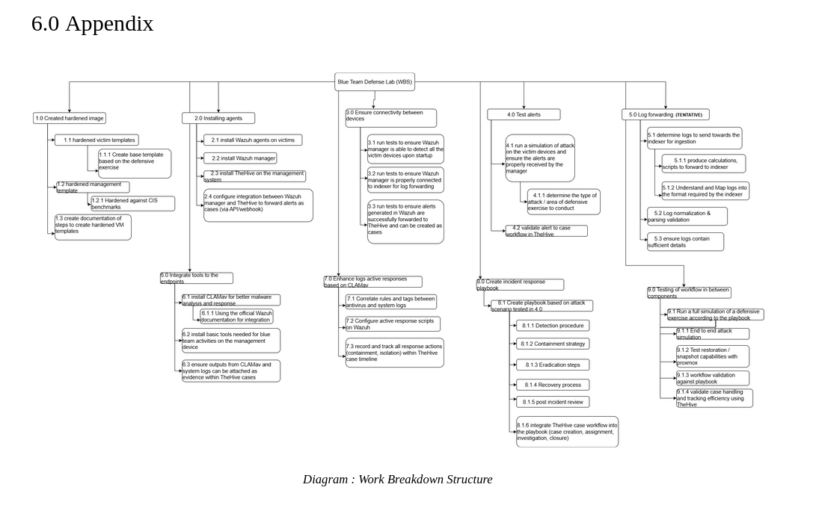

### Basic To do list
- [x] wazuh manager installation
- [x] wazuh agent installaiton (1 node)
- [ ] The HIVE installaiton
- [ ] CLAM AV installation
- [	] Manager node hardening according to CIS benchmark
- [ ] intergration of all components

Additional requirements:
- double confirm the required resources
- understand and use the wazuh manager tools to demonstrate understanding

### 18 June 2026
---
1. Installed ubuntu 22.04 (Jammy jellyfish) on 2 virtual machines
	- password : password 
2. Installed virtualbox guest additions for convenience later on 
	- install page needed to run the .iso `sudo apt install gcc make perl` , for the missing dependency

### 19 June 2026
---
1. downloading wazuh manager, following the quickstart guide to install at at once : 

	[Wazuh Quickstart guide](https://documentation.wazuh.com/current/quickstart.html)

	```bash
	curl -sO https://packages.wazuh.com/4.14/wazuh-install.sh
	
	sudo bash ./wazuh-install.sh -a
	```

- Hardware requirements :
	- Agents : 1–25
	- Cores : 4 vCPU
	-  RAM :  8 GiB 
	- Storage : 50 GB

	<details>
	<summary> Issue : installation </summary>
	Failed installation due to lack of space and memory, had to manually remove packages one by one taking up lots of time. Memory was increased to 6GB to support wazuh alone
	</details>

2. Reccommended disable the auto updates within the guide

	```bash
	sed -i "s/^deb /#deb /" /etc/apt/sources.list.d/wazuh.list

	apt update
	```

	[Wazuh single node deplayment](https://medium.com/@rupesharma203wazuh-single-node-installation-guide-for-home-lab-on-ubuntu-0eb2ca339408)

3. Testing the wazuh availability by opening the webpage on 
	- Webpage : `https://10.0.2.3:443`
	- User: `admin`
	- Password: `n*QH4zpz?nt9Te0SdV5?J5nJGEm+5zKP`

4. starting the Wazuh dashboard anytime before accessing the webpage 
	```bash
	sudo systemctl start wazuh-dashboard
	```
5. Additional :
	- to stop the services
	```bash 
	sudo systemctl stop wazuh-dashboard
	sudo systemctl stop wazuh-indexer
	sudo systemctl stop wazuh-manager
	```
	- to check what services are running :
	```bash
	systemctl list-units --type=service --state=running
	```
	- to check available system resources 
	```bash
	free -h
	```
	- check which services are using the most system resources
	```bash
	top 
	```
### 20 June 2026
---
1. installing wazuh agent on second device 
	<details>
	<summary> Issue : setting up second device </summary>
	1. Ping to check connectiviy between two devices `ip a` command to check

	- manager IP : `10.0.2.3`

	- victim IP : `10.0.2.15`

	- need to resolve the issue of having the same ip addresses
		- Create NAT network
		- assign two devices to NAT network
		- resolved

	- cmd to check connectivity : `ping -c 4 10.0.2.3`
	---
	</details>

	- Installation steps on wazuh manger agent deployment page:
		- package to install : DEB(debian) amd 64 | _extra info : RPM (red hat package manager)_
		- server address : `10.0.2.3`
		- cmd to run for installation on agent :
			```bash
			wget https://packages.wazuh.com/4.x/apt/pool/main/w/wazuh-agent/wazuh-agent_4.14.5-1_amd64.deb && sudo WAZUH_MANAGER='10.0.2.3' dpkg -i ./wazuh-agent_4.14.5-1_amd64.deb
			```
		- cmd to start agent :

			```bash
			sudo systemctl daemon-reload
			sudo systemctl enable wazuh-agent
			sudo systemctl start wazuh-agent
			```
		- cmd to check status :
			```bash
			sudo systemctl status wazuh-manager
			sudo systemctl status wazuh-indexer
			sudo systemctl status wazuh-dashboard	
			```
		<details>
		<summary> Issue : Succesfull setup but unable to connect on wazuh manager </summary>

		- TCP doesnt work, but DHCP(ping works)

		- troubleshooting :

			```bash
			sudo nc -l 1516
			```

			`nc` is a simple TCP server/client. If `-l` is used, it acts as a server. Otherwise it acts as a client. Used to test connectivity to a specific port.

		- solution : add `sudo` before running the manager, to ensure it has permissions to access ports

		</details>

2. Installing theHIVE on manager node

	[Detail regarding wazuh and the hive](https://wazuh.com/blog/using-wazuh-and-thehive-for-threat-protection-and-incident-response/)

	[Main : theHIVE setup guide](https://docs.strangebee.com/thehive/installation/installation-guide-linux-standalone-server/)

	[theHIVE hardware requirements for standard production](https://docs.strangebee.com/thehive/installation/system-requirements/)

	- Before installaiton, i must first be aware of theHIVE's architecture (TheHive application, database and indexing engine, and file storage), the current setup will be for a standalone server
	- Installaiton will be done using Docker for futureproof reasons
	- requirements :
		- docker engine
		- docker compose plugin
		- jq

	<details>
	<summary> Issue : NAT network setup but no internet access </summary>

	- solution (but lowkey like a duct tape fix): manually set the DNS server to 8.8.8.8 && 1.1.1.1 , the issue was DNS server was failing (as evident of ping google.com failing but ping 8.8.8.8 working)

	</details>

	Steps (Based on theHIVE setup guide): 
	1. update docker , install docker compose
	2. clone the repository
		```bash
		git clone https://github.com/StrangeBeeCorp/docker.git
		```
	3. navigate to prod1-thehive
		```bash
		cd docker/prod1-thehive
		```
	4. Before starting TheHive, initialize the environment using the provided init.sh script. within ./scripts
		```bash
		bash ./script/init.sh
		```
	5. start the docker containers containing the services theHive uses
		```bash
		sudo docker-compose up
		```
		- `-d` is to run in backgorund, omit to run in forground
		To reset when there's an error running up:
		```bash
		sudo docker-compose down
		```
		<details>
		<summary> Issue : docker compose corrupt </summary>
		
		- during  installation , several attempta of installing the hive with docker failed and the issues narrowed down to 
		</details>


### 21 June 2026
---
- installation for theHIVE failed with suspects being memory being used up
	- cassndra & elastishearch both's status is as up 
		```bash
		#error message after first failed docker compose attempt
		compose up
		Starting cassandra     ... done
		Starting elasticsearch ... done

		ERROR: for thehive  Container "d71af42b9a25" is unhealthy.
		ERROR: Encountered errors while bringing up the project.

		```
		```bash
		docker ps #to check that proceses from docker are up
		```
	- issue found from logs : 
		```
			{"@timestamp":"2026-06-21T12:44:03.511Z","log.level":"ERROR",
			"message":"fatal exception while booting Elasticsearch",
			...
			"error.message":"can not run elasticsearch as root",
			"error.stack_trace":"java.lang.RuntimeException: can not run 
			elasticsearch as root\n\tat org.elasticsearch.server@8.19.15/
			org.elasticsearch.bootstrap.Elasticsearch.initializeNatives...
		``` 
	- previous docker commands were run as root due to the issue faced in setting up wazuh, however after some digging it seems that it was not intended to run as root. Further analysis showed that there were some underlying issues, i had also not updated docker compose due to the misconception that `docker-compose` and `docker compose` are the same things. 
	- Solution : scrap the current state and restart
		- installing dependencies
		```
		# Add Docker's official GPG key
		sudo apt-get install ca-certificates curl
		sudo install -m 0755 -d /etc/apt/keyrings
		sudo curl -fsSL https://download.docker.com/linux/ubuntu/gpg -o /etc/apt/keyrings/docker.asc
		sudo chmod a+r /etc/apt/keyrings/docker.asc

		# Add Docker's repository
		echo \
		"deb [arch=$(dpkg --print-architecture) signed-by=/etc/apt/keyrings/docker.asc] https://download.docker.com/linux/ubuntu \
		$(. /etc/os-release && echo "$VERSION_CODENAME") stable" | \
		sudo tee /etc/apt/sources.list.d/docker.list > /dev/null

		# Update and install
		sudo apt-get update
		sudo apt-get install docker-compose-plugin

		# Verify
		docker compose version
		```
		- repeat the tasks listed in 20th June, **without** `sudo`
		- RAM is increased to 10GB as each component needed an avergae of 3GB~
		- run `docker compose up` when it shows unhealthy as the reason may be caused by timing for different applciation dependencies
		- upon running `docker compose ps`
		```bash
		NAME            IMAGE                   COMMAND                  SERVICE         CREATED         STATUS                   PORTS
		cassandra       cassandra:4.1.11        "docker-entrypoint.s…"   cassandra       2 minutes ago   Up 2 minutes (healthy)   7000-7001/tcp, 7199/tcp, 9042/tcp, 9160/tcp
		elasticsearch   elasticsearch:8.19.15   "/bin/tini -- /usr/l…"   elasticsearch   2 minutes ago   Up 2 minutes (healthy)   9200/tcp, 9300/tcp
		```
		a minimum of 10GB is needed to run theHIVE
		- access the hive by going to 
		```
		http://localhost
		```

### 22 June 2026
---
- TheHIVE installaiton halted due to unsufficient reosuce on personal device to run the program
- Conducted a physical meeting wit Mr murugan (industry supervisor). Resulting in new a new execution plan: 
```
Current todo :
Phase 1, setup the vms : 
	- settle management node : WAZUH manager
		- hardening based on benchmark will not be a big issue
	- create more than one assets (within the industry, teams survey the assets of companies and create a baseline)
		- 1 endpoint
		- 1 server
	Q : what if there are more devices in the furture, how do i manage that
Phase 2, Optimizing a SIEM (important), set up the use cases  (supervisor advice)
	- With SIEM , use case management is very important
	- system requires use cases for monitoring (wihtout usecases, what we get are just logs)
	- wazuh use case coverage /rule have unique ids (map use cases to wazuh rules)
<< 1 and 2 are harder to setup >>
Phase 3, configure MISP/OpenCTI (supervisor advice, optional but good for)
	- MISP is a threat management platform
	- OpenCTI is a threat enrichment ...
4. theHIVE
	- case creatiion
5. playbook	
	- serach up NIST fremework for exisitng playbooks
	- 
6. response
	- 
```

### 23 June 2026
---
- Not much progress, resolving an issue with a corrupted SSD which acted as the backup storage for this fyp project

### 24 June 2026
---
1. Conducted reasearch on creating rules
	Resource : 
	[WAZUH rules and decoders](https://www.youtube.com/watch?v=lEgb4f3Y7_Q)
	- rules : 
	- decoders : server management > decoders

2. 
[setting up SOC lab with DVWA as target](https://medium.com/@lokeshacharya/building-a-home-soc-lab-with-wazuh-c088af84ac95)
